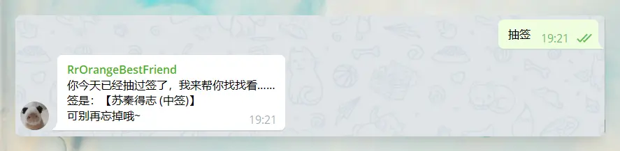

# trss-yunzai-telegram-adapter

`trss-yunzai-telegram-adapter` 适配器采用了 [格莱美 - grammY](https://github.com/grammyjs/grammY)，更灵活的中间件替换原本比较朴素无华的 [node-telegram-bot-api](https://github.com/yagop/node-telegram-bot-api)

⚠️ 适用范围：[Trss-Yunzai](https://gitee.com/TimeRainStarSky/Yunzai)

## 📋 安装教程

1. 准备：[TRSS-Yunzai](https://gitee.com/TimeRainStarSky/Yunzai)

2. 【第一次 / 更新】：在`TRSS-Yunzai`目录下输入以下命令
   > curl -fsSL https://gitee.com/kyrzy0416/trss-yunzai-telegram-adapter/raw/master/index.js > plugins/adapter/Telegram.js  

   > // 安装依赖  
   > pnpm install grammy -w
3. 打开：[BotFather](https://t.me/BotFather) 创建 Bot：  

   - /newbot  

   - /mybots → API Token → 得到 `Token`

4. 输入：`#TG设置Token`

   > 比如：#TG设置7125519xxx:xxxxxxx.....
   

⚠️ 删除适配器，在`TRSS-Yunzai`目录下输入以下命令：
> rm -rf ./plugins/adapter/Telegram.js

## 🎓 使用教程

- #TG账号
- #TG设置 + `Token`
- #TG代理/反代 + `scheme://[userinfo@]host[:port]`

## 🐛 问题

### 📦 关于大文件发送

grammY官方是这样说的：

> grammY itself can send files without any size limits, however, Telegram restricts file sizes as documented [here](https://core.telegram.org/bots/api#sending-files). This means that your bot cannot download files larger than 20 MB, or upload files larger than 50 MB. Some combinations have even stricter limits, such as photos sent by URL (5 MB).
>
> As mentioned in an [earlier section](https://grammy.dev/guide/api), your bot is able to work with large files with some extra effort. If you want to support uploading files up to 2000 MB (maximum file size on Telegram) and downloading files of any size ([4000 MB with Telegram Premium](https://t.me/premium/5)), you must [host your own Bot API server](https://grammy.dev/guide/api#running-a-local-bot-api-server) in addition to hosting your bot.
>
> Hosting your own Bot API server has, in and of itself, nothing to do with grammY. However, grammY supports all of the methods that are needed to configure your bot to use your own Bot API Server.

---

中文翻译过来是这样：

> grammY本身可以发送没有任何大小限制的文件，但是，Telegram限制文件大小，如[这里所](https://core.telegram.org/bots/api#sending-files)述。这意味着您的机器人无法下载大于20 MB的文件，或上传大于50 MB的文件。某些组合有更严格的限制，例如通过URL发送的照片（5 MB）
>
> 如[前所](https://grammy.dev/guide/api)述，您的机器人能够通过一些额外的工作来处理大文件。如果您希望支持上传最大2000 MB的文件（Telegram上的最大文件大小）和下载任何大小的文件（[Telegram Premium为4000 MB](https://t.me/premium/5)），则除了托管您的机器人之外，您还必须[托管您自己的机器人API服务器](https://grammy.dev/guide/api#running-a-local-bot-api-server)
>
> 托管您自己的Bot API服务器本身与grammY无关。但是，grammY支持配置您的机器人使用您自己的机器人API服务器所需的所有方法

## 🪧 效果

### 文字发送

### 语音发送

### 图片发送

### 视频发送

