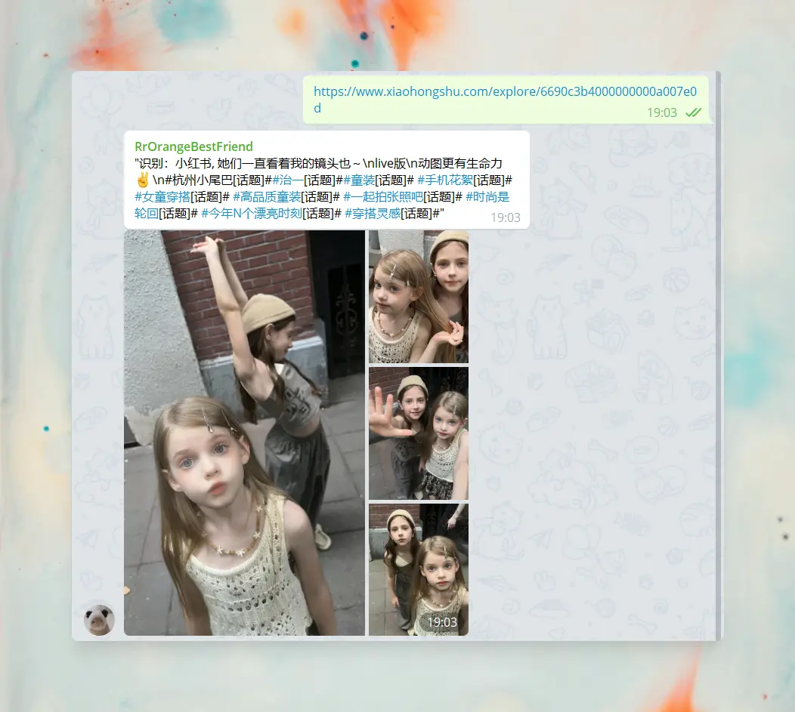
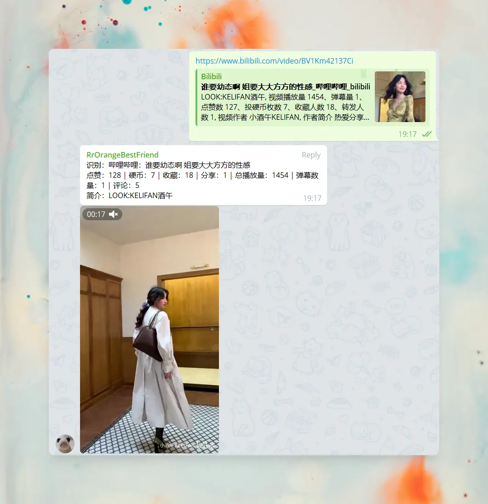

# trss-yunzai-telegram-adapter

`trss-yunzai-telegram-adapter` 适配器采用了 [格莱美 - grammY](https://github.com/grammyjs/grammY)，更灵活的中间件替换原本比较朴素无华的 [node-telegram-bot-api](https://github.com/yagop/node-telegram-bot-api)

⚠️ 适用范围：[Trss-Yunzai](https://gitee.com/TimeRainStarSky/Yunzai)

## 📋 安装教程

1. 准备：[TRSS-Yunzai](https://gitee.com/TimeRainStarSky/Yunzai)

2. 【第一次 / 更新】输入：在`TRSS-Yunzai`目录下输入以下命令
   > curl -fsSL https://gitee.com/kyrzy0416/trss-yunzai-telegram-adapter/raw/master/index.js > plugins/adapter/Telegram.js

3. 打开：[BotFather](https://t.me/BotFather) 创建 Bot：  

   - /newbot  

   - /mybots → API Token → 得到 `Token`

4. 输入：`#TG设置Token`

   > 比如：#TG设置7125519xxx:xxxxxxx.....
   

⚠️ 删除适配器，在`TRSS-Yunzai`目录下输入以下命令：
> rm -rf ./plugins/adapter/Telegram.js

## 🎓 使用教程

- #TG账号
- #TG设置 + `Token`
- #TG代理/反代 + `scheme://[userinfo@]host[:port]`

## 🪧 效果

### 文字发送

### 语音发送

### 图片发送

### 视频发送

